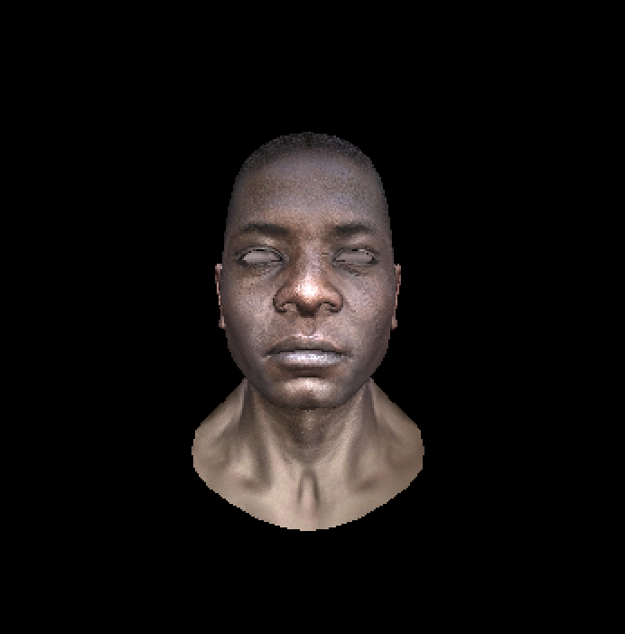

# LittleRenderer

A simple rasterizer.

## How to run

First install the dependencies using the requirements.txt file. Then simply run the main.py file. To render your own models add them to the test_models directory and add the paths of the OBJ files and textures in main.py.

## Sample Output

